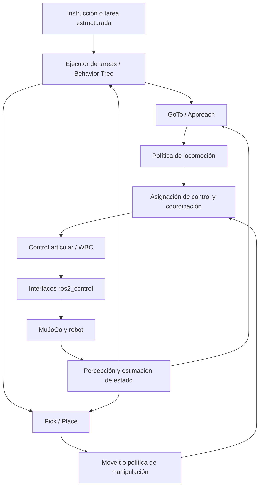

# Aprender a construir el stack de locomanipulación del G1

Esta guía acompaña a [planHumanoid_mujoco.md](planHumanoid_mujoco.md). Está pensada para alguien que ya conoce ROS 2 y RL, pero quiere entender cómo pasar de ejemplos aislados a un sistema robótico reproducible, medible y ampliable.

El objetivo es que puedas explicar y construir la cadena **tarea → aproximación → agarre → transporte → colocación**, identificar por qué falla y sustituir un módulo sin rehacer los demás. “De 0 a 100” significa cubrir ese recorrido y sus prerrequisitos; dominar cada área de investigación requiere estudios adicionales. No necesitás terminar toda la bibliografía antes de avanzar: cada bloque tiene una práctica y una condición de salida.

Las referencias externas se consultaron el 6 de septiembre de 2026. Los enlaces a `main`, `stable` o documentación Rolling pueden diferir de las versiones del workspace. Son referencias de estudio, no una matriz de compatibilidad probada. Algunas páginas de ROS impidieron la lectura automatizada; se conservan sus enlaces oficiales para consulta manual.

## Índice

1. [Punto de partida y decisiones pendientes](#1-punto-de-partida-y-decisiones-pendientes)
2. [Mapa mental del sistema](#2-mapa-mental-del-sistema)
3. [Matemática, cinemática y dinámica](#3-matemática-cinemática-y-dinámica)
4. [Ingeniería y herramientas](#4-ingeniería-y-herramientas)
5. [MuJoCo y modelos del robot](#5-mujoco-y-modelos-del-robot)
6. [ROS 2 y control](#6-ros-2-y-control)
7. [Manipulación, MoveIt y agarres](#7-manipulación-moveit-y-agarres)
8. [Locomoción, estimación y navegación](#8-locomoción-estimación-y-navegación)
9. [Skills y orquestación](#9-skills-y-orquestación)
10. [Whole-body control](#10-whole-body-control)
11. [Percepción](#11-percepción)
12. [RL aplicado al proyecto](#12-rl-aplicado-al-proyecto)
13. [Imitation learning y datos](#13-imitation-learning-y-datos)
14. [VLM y VLA](#14-vlm-y-vla)
15. [World models](#15-world-models)
16. [Repositorios para estudiar](#16-repositorios-para-estudiar)
17. [Flujo profesional y evaluación](#17-flujo-profesional-y-evaluación)
18. [Ruta práctica y hardware](#18-ruta-práctica-y-hardware)
19. [Autoevaluación](#19-autoevaluación)

## 1. Punto de partida y decisiones pendientes

El plan describe fases 0–16, pero este directorio ya contiene implementación y documentación hasta la fase 5. Esto se deduce del código y del README; la elaboración de esta guía no incluye una nueva ejecución de la simulación.

Empezá por [las explicaciones existentes](exp/README.md) y [el estado de validación](exp/07_estado_validacion.md). Después recorré estos archivos:

| Archivo | Pregunta que deberías poder responder |
|---|---|
| [scripts/sim.sh](scripts/sim.sh) | ¿Qué entorno carga y qué launch ejecuta? |
| [simulation.launch.py](src/g1_bringup/launch/simulation.launch.py) | ¿Quién arranca MuJoCo, controladores, TF y MoveIt? |
| [URDF/Xacro](src/g1_description/urdf/g1_29dof.urdf.xacro) | ¿Qué articulaciones, límites e interfaces existen? |
| [modelo MJCF](src/g1_mujoco/mjcf/g1_29dof.xml) y [escena](src/g1_mujoco/scenes/scene_29dof.xml) | ¿Qué simula realmente la física? |
| [controllers.yaml](src/g1_control/config/controllers.yaml) | ¿Quién convierte referencias en esfuerzo? |
| [move_to_pose.cpp](src/g1_manipulation/src/move_to_pose.cpp) | ¿Cómo pasa una pose a planificación y ejecución? |
| [dependencies.repos](dependencies.repos) y [environment.yml](environment.yml) | ¿Qué está fijado y qué puede cambiar al reinstalar? |

Hay cinco precisiones necesarias para interpretar el plan:

- **La base empieza fijada.** Esto permite estudiar brazos sin resolver equilibrio. Liberarla no crea automáticamente un humanoide capaz de mantenerse de pie.
- **`whole_body_controller` es un nombre local.** Su tipo es `JointTrajectoryController`, sobre 29 joints y con interfaz de esfuerzo. No es un WBC que optimice contactos y balance.
- **Las manos actuales son rígidas.** El URDF tiene articulaciones fijas hacia `left_rubber_hand` y `right_rubber_hand`. La fase “Close Hand” exige incorporar un efector actuado o declarar explícitamente un agarre simplificado.
- **La escena de planificación y la escena física son distintas.** Agregar una mesa u objeto a MoveIt no lo crea en MuJoCo. Adjuntarlo a una mano en MoveIt tampoco genera fuerzas de agarre.
- **El reloj tiene una excepción local.** El launch deja `use_sim_time:=false` y documenta problemas de tiempo no monótono del plugin usado. Estudiá y validá esa limitación antes de cambiar el reloj de todos los nodos.

Podés conservar el orden incremental del plan. La salvedad física es que, antes de transportar un objeto con base libre, necesitás una solución de balance compatible con brazos y carga. Puede ser una política existente; estudiar WBC avanzado puede esperar a la fase 13, pero el equilibrio no puede esperar hasta después de la demo de transporte.

## 2. Mapa mental del sistema



Es una arquitectura conceptual: la implementación exacta puede integrar varios bloques en el mismo proceso. `ros2_control` administra interfaces y controladores; no equivale por sí mismo a un algoritmo de equilibrio.

| Concepto | Qué resuelve | Qué entrega |
|---|---|---|
| Planificación de tarea | Qué habilidad ejecutar y en qué orden | Goals de skills |
| Planificación de movimiento | Cómo llegar respetando restricciones geométricas | Camino o trayectoria |
| Control | Cómo seguir una referencia usando feedback | Comandos al actuador |
| Estimación | Qué estado tiene el robot a partir de sensores | Pose, velocidad, incertidumbre |
| Simulación | Cómo evoluciona el sistema bajo acciones y contactos | Estado y sensores simulados |
| Aprendizaje | Cómo ajustar una política o modelo con datos | Parámetros entrenados |

Una política aprendida puede ocupar distintas capas. Una que produce velocidad de marcha requiere otro controlador debajo; una que produce torques asume muchas más responsabilidades.

## 3. Matemática, cinemática y dinámica

### Qué necesitás entender

1. Vectores, matrices, derivadas, mínimos cuadrados, autovalores y optimización con restricciones.
2. Rotaciones, cuaterniones y transformaciones rígidas `SE(3)`: expresar la misma pose en cámara, pelvis y mundo.
3. Cinemática directa: `q → pose de mano`; cinemática inversa: `pose deseada → q`.
4. Jacobianos: relación local entre velocidades articulares y movimiento cartesiano; singularidades y redundancia.
5. Dinámica, gravedad, inercia, torque, fricción y contacto unilateral.
6. Feedback: PD/PID, saturación, amortiguamiento, estabilidad y latencia.
7. Probabilidad básica: ruido, covarianza, estimación y diferencia entre estado verdadero y observado.

Para una base flotante, una escritura útil de la dinámica es:

```text
M(q) · v_dot + h(q, v) = Sᵀ · tau + J_contacto(q)ᵀ · lambda
```

`q` describe la configuración; `v`, las velocidades generalizadas; `M`, la inercia; `h`, los términos gravitatorios y de movimiento; `tau`, los torques actuados; `lambda`, las fuerzas de contacto. `S` selecciona los grados actuados: no hay motores que apliquen directamente seis comandos independientes a la pelvis en el aire. Con cuaterniones, `q` y `v` pueden tener dimensiones diferentes.

La relevancia práctica es simple: alcanzar una pose de mano cambia masas y momentos; aunque la IK encuentre una solución, el robot puede perder equilibrio.

### Recursos y práctica

- [Modern Robotics, Lynch y Park](https://modernrobotics.northwestern.edu/nu-gm-book-resource/): capítulos 3–6 para transformaciones, cinemática e IK; luego 8–11 para dinámica, trayectorias, planificación y control. Usá sus videos y ejercicios junto al libro.
- [Underactuated Robotics, MIT](https://underactuated.mit.edu/): sistemas subactuados, contactos, locomoción y control óptimo. Leelo después de poder explicar un PD y un Jacobiano.
- [Pinocchio](https://github.com/stack-of-tasks/pinocchio): ejemplos de cálculo de cinemática y dinámica. Es una biblioteca de algoritmos, no un stack listo de navegación o agarre.

**Práctica:** calculá la pose de una mano con cinemática directa y comparala con TF para la misma configuración. Transformá un objetivo de `world` a pelvis y verificá que representa el mismo punto físico.

**Podés avanzar cuando:** explicás por qué IK puede fallar, por qué una solución geométrica puede ser inestable y por qué no se pueden restar componentes de cuaterniones como si fueran ángulos independientes.

## 4. Ingeniería y herramientas

El flujo profesional empieza al poder reconstruir y diagnosticar el sistema, incluso cuando no lo ejecutás desde tu terminal habitual.

| Área | Aprendizaje concreto | Aplicación aquí |
|---|---|---|
| Linux | Procesos, señales, permisos, variables y bibliotecas compartidas | Separar errores del sistema y del robot |
| Python | Entornos, empaquetado, NumPy, tipos y profiling | Scripts, datos e inferencia |
| C++ | RAII, referencias, ownership, callbacks y concurrencia | MoveIt, plugins y control |
| CMake/ament/colcon | Dependencias, instalación y overlays | Entender por qué compila pero no encuentra recursos |
| Git | Commits pequeños, ramas, revisión, diff y bisect | Rastrear regresiones |
| rosdep/vcstool | Dependencias del sistema y código externo | Reproducir el workspace |
| Tests y CI | Tests unitarios, integración y simulación headless | Detectar contratos rotos |
| Profiling | CPU/GPU, memoria, latencia y jitter | Saber si se cumplen tiempos |

Lecturas aplicadas: [instalación local](exp/01_instalacion.md), [arquitectura](exp/02_arquitectura.md), [pruebas y debug](exp/05_pruebas_y_debug.md) y los tutoriales de workspace, paquetes y dependencias en [ROS 2 Jazzy](https://docs.ros.org/en/jazzy/Tutorials.html).

En este proyecto hay software ROS del sistema y un entorno Conda. Estudiá qué Python usa cada script y qué rutas modifica [activate.sh](scripts/activate.sh); evitá corregir un conflicto instalando paquetes al azar en ambos entornos. Un contenedor ayuda a reproducir dependencias, pero también requiere configurar gráficos, GPU y comunicación ROS.

**Práctica:** escribí una ficha del entorno con SO, ROS, Python, MuJoCo, commit del plugin y comandos de build. Compará esa ficha con los archivos existentes: MuJoCo está fijado a `3.3.6` y el plugin a un commit; varias dependencias de Conda tienen sólo límites inferiores, así que el entorno aún no constituye un lock completo.

**Podés avanzar cuando:** podés explicar qué se configura, compila, instala y carga al ejecutar `./scripts/sim.sh`.

## 5. MuJoCo y modelos del robot

### Separá las representaciones

**URDF/Xacro** expresa estructura cinemática y propiedades del robot para ROS. **SRDF** agrega semántica para MoveIt: grupos, estados y relaciones de colisión. **MJCF** describe el modelo físico de MuJoCo, incluidos actuadores, contactos y restricciones. **RViz** visualiza datos; no resuelve física.

Un mesh visual bonito no garantiza una geometría de contacto adecuada. Tampoco basta que los nombres coincidan: ejes, offsets, unidades, límites y postura nominal deben coincidir entre modelos.

### Temas de estudio

- `MjModel` contiene el modelo compilado; `MjData`, el estado de simulación y resultados de cálculo.
- Diferenciá `qpos`, `qvel` y `ctrl`. La interpretación de `ctrl` depende del actuador configurado.
- Entendé el timestep, integración, solver, gravedad, amortiguamiento y parámetros de contacto.
- Estudiá `freejoint`, `geom`, `site`, sensores y restricciones `equality`.
- Separá pasos de física, actualizaciones de control y renderizado.
- Un reset de episodio debe reiniciar también buffers, integradores, acciones previas y estado recurrente de políticas.

Empezá por [MuJoCo Overview](https://mujoco.readthedocs.io/en/stable/overview.html) y seguí las secciones de Modeling, Computation, XML Reference y Python desde su índice. Contrastá las APIs con la versión `3.3.6` fijada aquí. Complementá con [modelos URDF/MJCF del proyecto](exp/03_modelos_urdf_mjcf.md).

**Práctica:** con base fijada, cambiá una referencia pequeña de un joint y registrá posición, velocidad y esfuerzo. Después compará una escena mínima con distinta fricción o timestep, cambiando una variable por vez. Guardá los resultados; no ajustes simultáneamente solver, masas y ganancias para ocultar un fallo.

**Podés avanzar cuando:** distinguís un error del modelo, una inestabilidad numérica y un controlador mal ajustado mediante mediciones.

## 6. ROS 2 y control

Como ya conocés ROS 2, concentrá el repaso en sus consecuencias sobre un robot que se mueve.

### Paquetes y conceptos que necesitás

| Componente | Para qué lo vas a usar |
|---|---|
| `rclcpp` / `rclpy`, actions | Goals largos con feedback, resultado y cancelación |
| `tf2`, `robot_state_publisher` | Transformaciones temporales y cinemática del árbol |
| `sensor_msgs`, `geometry_msgs`, `trajectory_msgs`, `control_msgs` | Estados, poses, trayectorias y acciones estándar |
| `ros2_control`, `controller_manager` | Ciclo de lectura/actualización/escritura y recursos |
| `joint_state_broadcaster` | Publicación de estados articulares |
| `joint_trajectory_controller` | Seguimiento de trayectorias temporizadas |
| `mujoco_ros2_control` | Adaptación de interfaces al simulador |
| `rosbag2`, RViz, herramientas CLI | Registro e inspección |
| Lifecycle, launch, parámetros | Arranque, configuración y disponibilidad |

El adaptador oficial ofrece una interfaz de sistema y ejemplos para ejecutar controladores ROS sobre MuJoCo. Estudiá primero una demo pequeña y luego el mapeo de actuadores del G1. Fuente: [mujoco_ros2_control](https://github.com/ros-controls/mujoco_ros2_control).

### El lazo que debés poder seguir

```text
referencia con tiempo
→ controlador lee estado
→ calcula comando
→ hardware interface escribe en MuJoCo
→ física avanza
→ hardware interface lee nuevo estado
→ feedback y siguiente actualización
```

En la configuración local, el manager solicita 500 Hz y el broadcaster 100 Hz. Son valores configurados, no mediciones de frecuencia efectiva. Una referencia de posición puede terminar como esfuerzo: el controlador de trayectorias admite configuración PID para interfaces de esfuerzo. Revisá tolerancias, errores y cancelación en la [documentación Jazzy del JointTrajectoryController](https://control.ros.org/jazzy/doc/ros2_controllers/joint_trajectory_controller/doc/userdoc.html).

Una ley ilustrativa es `tau = Kp(q_ref − q) + Kd(v_ref − v) + tau_ff`. No significa que todo actuador o plugin implemente exactamente esa ley. Determiná dónde está el feedback para evitar duplicarlo inadvertidamente.

### Problemas profesionales que aparecen temprano

- **Tiempo:** TF, sensores y acciones necesitan timestamps coherentes. Pausar o resetear simulación cambia la relación con el reloj de pared.
- **QoS:** un publicador y un suscriptor pueden existir sin intercambiar mensajes si sus políticas son incompatibles. Revisá [QoS en Jazzy](https://docs.ros.org/en/jazzy/Concepts/Intermediate/About-Quality-of-Service-Settings.html).
- **Concurrencia:** una llamada bloqueante en un callback puede impedir que llegue el resultado que espera. Estudiá executors y callback groups.
- **Control exclusivo:** cada interfaz de comando necesita un dueño claro. Un objetivo parcial al controlador de 29 joints no libera los otros joints para otra política.
- **Disponibilidad:** esperar un tiempo fijo no demuestra que un servidor o controlador esté listo; usá estados y comprobaciones explícitas al robustecer el arranque.

Convenciones: [REP-103](https://www.ros.org/reps/rep-0103.html) para unidades y ejes; [REP-105](https://www.ros.org/reps/rep-0105.html) para frames móviles. `robot_state_publisher` calcula transforms articulares; la pose de la base flotante necesita otra fuente.

**Práctica con el workspace compilado y la simulación iniciada:**

```bash
source scripts/activate.sh
ros2 control list_controllers
ros2 control list_hardware_interfaces
ros2 topic echo /joint_states --once
ros2 topic hz /joint_states
ros2 action list -t
ros2 run tf2_ros tf2_echo world pelvis
```

**Podés avanzar cuando:** seguís un goal hasta su esfuerzo y feedback, y diagnosticás si el fallo viene de frames, tiempo, interfaces o seguimiento.

## 7. Manipulación, MoveIt y agarres

MoveIt aporta herramientas de cinemática, planificación, colisiones y ejecución. En este proyecto estudiá SRDF, grupos de brazos, solver de IK, planificación OMPL, parametrización temporal y conexión con `FollowJointTrajectory`. Una trayectoria libre de colisiones puede ser imposible de seguir por límites dinámicos o pérdida de balance.

Leé [la explicación local de MoveIt](exp/08_moveit_planificacion.md). Después estudiá el [tutorial oficial de Pick and Place con MoveIt Task Constructor](https://moveit.picknik.ai/main/doc/tutorials/pick_and_place_with_moveit_task_constructor/pick_and_place_with_moveit_task_constructor.html): muestra cómo componer etapas de planificación. La página corresponde a Rolling; usá APIs compatibles con tu instalación Jazzy.

### Qué agrega realmente Pick

Necesitás definir el objeto, su pose y frame, una transformación de agarre, preaproximación, cierre, criterio de sujeción, elevación y retirada. Si la transformación del agarre está definida respecto al objeto:

```text
T_world_grasp = T_world_object · T_object_grasp
```

El TCP es el frame de trabajo del efector: no necesariamente coincide con el último joint de la muñeca. Un error de TCP puede producir una planificación correcta que falla físicamente.

Elegí y documentá el nivel del primer prototipo:

| Nivel | Implementación | Qué demuestra |
|---|---|---|
| Agarre simplificado | Restricción temporal mano–objeto en MuJoCo, activada bajo condiciones explícitas | Secuencia y transporte con una sujeción idealizada |
| Pinza actuada | Joints, actuadores y contactos de un efector sencillo | Agarre físico de objetos limitados |
| Mano diestra | Dedos, contactos múltiples y control de fuerzas/postura | Manipulación más general y mucho más compleja |

La primera alternativa es útil para integrar, pero su éxito no demuestra estabilidad de un agarre por fricción. `attachObject` sólo actualiza el modelo de colisiones de MoveIt; la sujeción física debe implementarse aparte. Durante Place, también hay que verificar apoyo y liberación en MuJoCo, además de actualizar MoveIt.

**Práctica:** ejecutá `home`, alcanzá varias poses con base fijada y compará planificación con/sin obstáculo. Luego diseñá Pick para un único cubo, dejando explícito el modelo de efector y el criterio de éxito. Probá una pose fuera de alcance y una cancelación durante la aproximación.

**Podés avanzar cuando:** Pick informa éxito por un estado observado del objeto, y podés explicar la diferencia entre “plan encontrado”, “trayectoria ejecutada” y “objeto sujeto”.

## 8. Locomoción, estimación y navegación

Son tres problemas conectados. **Locomoción** mantiene el movimiento estable y responde a referencias. **Estimación** calcula pose y velocidad. **Navegación** elige cómo alcanzar una meta evitando obstáculos.

### Integrar una política existente

[Unitree RL Mjlab](https://github.com/unitreerobotics/unitree_rl_mjlab) ofrece tareas de seguimiento de velocidad y movimiento para robots Unitree, incluido G1, y un recorrido de entrenamiento, reproducción y despliegue. Usalo para estudiar el contrato de inferencia antes de modificar rewards.

Un checkpoint requiere recuperar:

- Variante del robot, número y orden de articulaciones.
- Postura nominal, ganancias y límites de torque.
- Observaciones, historial, normalización y convenciones de orientación.
- Definición y escala de acciones; frecuencia de inferencia y decimación.
- Estado recurrente, reset y comandos esperados.
- Dependencias de sensores o estado privilegiado presentes durante entrenamiento.

Por ejemplo, `q_ref = q_nominal + action_scale · action` es una convención frecuente, pero debe comprobarse en la política elegida. Conectar una salida interpretada como offset a una interfaz que espera torque rompe el contrato aunque las dimensiones coincidan.

Reproducí primero la política en su entorno original. Después validá el traslado al modelo y loop de este proyecto (**sim-to-sim**). ROS entra cuando ambos extremos coinciden. [unitree_mujoco](https://github.com/unitreerobotics/unitree_mujoco) sirve para estudiar simulación y comunicación en el ecosistema Unitree; no debe suponerse idéntico al adaptador `ros2_control` local.

### GoTo y estimación

Para un primer GoTo, calculá el error de pose, expresá la velocidad en el frame que espera la política, limitá su magnitud y verificá distancia y orientación final. Agregá timeout y detección de falta de progreso. Un proporcional hacia una meta no evita obstáculos.

Podés empezar usando la pose verdadera del simulador, identificada como **ground truth**. Más adelante, estudiá fusión de IMU, cinemática de contactos y odometría visual/LiDAR: sesgos, covarianzas y deriva. Una IMU sola no te da una posición global estable mediante integración indefinida.

[Nav2](https://docs.nav2.org/) es una referencia para planificación, costmaps y ejecución de navegación. Antes de integrarlo, el humanoide debe tener una interfaz de velocidad y odometría consistente. El balance y la viabilidad de pasos siguen siendo responsabilidad de la capa de locomoción.

**Práctica:** caminar una distancia corta, detenerse, girar y repetir. Después repetí con distintas posturas de brazos y, sólo tras validar balance, una carga pequeña simulada. Medí caídas, error de velocidad, distancia de frenado y error final.

**Podés avanzar cuando:** explicás qué mantiene el balance al detenerse y por qué una política que camina sin carga podría fallar transportando un objeto.

## 9. Skills y orquestación

Una skill es una capacidad con contrato. Definí precondiciones, goal, feedback, resultado, cancelación, timeout y efectos sobre el estado del mundo.

Para `Pick`, una interfaz futura podría incluir `object_id`, `PoseStamped` y brazo seleccionado; feedback de etapa; resultado con código y explicación. Distinguí errores como `TF_UNAVAILABLE`, `UNREACHABLE`, `EXECUTION_FAILED` y `GRASP_FAILED`. Son propuestas, no interfaces ya implementadas.

Una cancelación debe dejar un estado definido: cancelar el transporte no debería soltar automáticamente el objeto. Un reintento de Pick debe comprobar si el objeto ya está sujeto. Estos detalles vuelven reutilizable una skill.

Empezá con una máquina de estados. Luego estudiá `SUCCESS`, `FAILURE`, `RUNNING`, secuencias, fallback, blackboard y nodos asíncronos en [BehaviorTree.CPP](https://www.behaviortree.dev/docs/intro/). [BehaviorTree.ROS2](https://github.com/BehaviorTree/BehaviorTree.ROS2) contiene utilidades para integrarlo con ROS 2.

MoveIt Task Constructor organiza etapas de planificación de manipulación; un Behavior Tree organiza ejecución de misión y recuperaciones. Pueden complementarse.

**Práctica:** simulá un fallo de agarre, reintentá como máximo una cantidad definida y terminá con un resultado explicativo. Probá cancelación en cada etapa y pérdida temporal de percepción.

**Podés avanzar cuando:** cambiás la misión sin modificar el controlador y los fallos no producen bucles infinitos ni comandos huérfanos.

## 10. Whole-body control

WBC coordina objetivos de manos, torso, centro de masa y contactos bajo restricciones. Puede ser cinemático o dinámico; resolver IK de cuerpo completo no garantiza que las fuerzas necesarias sean realizables.

Estudiá centro de masa, polígono de soporte, ZMP y sus supuestos, momento centroidal, conos de fricción, prioridades de tareas y problemas cuadráticos (QP). El criterio de proyección del centro de masa ayuda en situaciones cuasiestáticas, pero no describe por sí solo toda la estabilidad dinámica de la marcha.

Un WBC dinámico puede optimizar aceleraciones, torques y fuerzas, sujeto a ecuaciones de movimiento, contacto y límites. MPC planifica sobre un horizonte y vuelve a optimizar; puede trabajar sobre un modelo reducido y delegar seguimiento al WBC.

Recursos, en orden:

1. [Pink](https://github.com/stephane-caron/pink): IK diferencial mediante Pinocchio y QP; útil para comprender tareas cinemáticas.
2. [TSID](https://github.com/stack-of-tasks/tsid): dinámica inversa en espacio de tareas.
3. [OCS2](https://github.com/leggedrobotics/ocs2): control óptimo de sistemas con cambios de modo/contacto; integración avanzada.
4. [MuJoCo MPC](https://github.com/google-deepmind/mujoco_mpc): ejemplos de control predictivo sobre MuJoCo.

Ninguno debe asumirse como plugin listo para este G1 y Jazzy. Necesitás adaptar modelo, contactos, límites, interfaz y tiempos.

**Práctica:** reproducí primero un ejemplo del proyecto elegido. Después planteá alcanzar con una mano manteniendo pies y postura, explicitando qué restricciones son cinemáticas y cuáles dinámicas.

**Podés avanzar cuando:** sabés quién manda torso, brazos y piernas, y cómo se resuelve un objetivo incompatible con contacto o torque disponible.

## 11. Percepción

La interfaz ideal entrega identidad del objeto, pose con timestamp y frame, e incertidumbre o confianza. “Detecté un vaso en un rectángulo” todavía no especifica una pose 6D de agarre.

Aprendé intrínsecos de cámara, extrínsecos, proyección, profundidad, nubes de puntos, segmentación, pose 6D, oclusiones y sincronización. Estudiá `image_transport`, `cv_bridge`, `image_geometry` y `message_filters` desde el ecosistema ROS, comprobando sus versiones Jazzy.

Progresión propuesta: pose fija → ground truth de MuJoCo → marcador de geometría conocida → RGB-D y estimación → objetos variados. Medí cada salto contra el ground truth reservado para evaluación.

**Práctica:** transformá una observación de cámara a `world` en el instante de captura. Agregá ruido y retraso para medir cuándo falla Pick. Rechazá observaciones demasiado antiguas y definí cuándo volver a observar tras caminar.

**Podés avanzar cuando:** distinguís error de detección, profundidad, calibración, TF y antigüedad del dato.

## 12. RL aplicado al proyecto

Ya conocés RL: enfocá el estudio en la distancia entre un algoritmo que mejora reward y una política que se puede integrar.

### Contrato del entorno

Definí observaciones disponibles en ejecución, acciones y unidades, período de decisión, reset, distribución inicial, rewards, terminaciones y métricas externas. Diferenciá terminación física y truncación temporal al calcular targets. Si el estado no es completamente observable, necesitás historial o memoria y una evaluación acorde.

Un actor con observaciones de sensores puede entrenarse junto a un crítico con estado privilegiado, pero el actor desplegado debe funcionar sin esos datos exclusivos del simulador.

Empezá con PPO y políticas pequeñas de estado para entender rollout, advantage, clipping y normalización en una implementación concreta. [RSL-RL](https://github.com/leggedrobotics/rsl_rl) es una referencia orientada a robótica. [MuJoCo Playground](https://github.com/google-deepmind/mujoco_playground) permite estudiar entornos de robot learning acelerados por GPU; elegí un framework inicial para evitar migraciones simultáneas.

### Experimentos útiles aquí

| Experimento | Observaciones | Acciones | Comparación necesaria |
|---|---|---|---|
| Llegar con un brazo fijo | Estado articular, objetivo | Referencias limitadas | IK/MoveIt |
| Locomoción robusta | Propriocepción, comando | Según política base | Checkpoint original |
| Coordinación | Estado de skills, pose relativa | Velocidad y selección de habilidad | Máquina de estados |
| Control residual | Estado y salida nominal | Corrección acotada | Control nominal solo |

La randomización debe representar incertidumbres relevantes: masas, fricción, ganancias, retardos y sensores. Randomizar sin rangos razonados puede dificultar el aprendizaje sin mejorar la transferencia.

**Práctica:** reproducí un baseline, evaluá con escenarios y seeds reservados, cambiá una sola hipótesis y compará éxito, caídas y coste computacional. Mantené fuera de la selección de hiperparámetros el conjunto final de prueba.

**Podés avanzar cuando:** una mejora persiste en evaluación y podés exportar la política con su normalización y contrato completo, no sólo un archivo de pesos.

## 13. Imitation learning y datos

En IL aprendés a partir de demostraciones. En **behavior cloning (BC)**, el objetivo básico ajusta `pi(observación)` a la acción demostrada. Una pérdida baja no asegura buenos episodios: pequeños errores llevan a estados ausentes del dataset y se acumulan.

Estudiá distribución de datos, multimodalidad, historia temporal, representación de acciones y DAgger: recolectar correcciones de un experto en estados visitados por la política. En movimiento humanoide, además necesitás **retargeting**: adaptar movimientos humanos a la geometría y límites del robot. Un movimiento retargeteado puede seguir siendo dinámicamente inviable.

### Orden de lectura

1. [robomimic](https://github.com/ARISE-Initiative/robomimic): datasets, entrenamiento y evaluación de aprendizaje por demostración.
2. [LeRobot](https://github.com/huggingface/lerobot): herramientas de datos, políticas y ejecución. Elegilo como posible infraestructura de experimentos; comprobá el adaptador concreto de tu robot.
3. [ACT](https://github.com/tonyzhaozh/act): predicción de bloques de acciones; estudiá horizonte y agregación temporal.
4. [Diffusion Policy](https://diffusion-policy.cs.columbia.edu/): generación de secuencias de acciones por difusión. Compará calidad y coste de inferencia con BC.
5. [BeyondMimic / whole_body_tracking](https://github.com/HybridRobotics/whole_body_tracking): seguimiento de movimiento humanoide. Imitar mediante una recompensa de tracking y RL no es lo mismo que BC supervisado.

### Tu primer dataset

Recolectá demostraciones de una skill pequeña con base fija. Podés usar teleoperación o trayectorias de un planificador como fuente inicial, identificando su procedencia. Guardá por episodio:

```text
id, seed, versión de escena y robot, fuente de demostración
observaciones con timestamps, estado articular, poses y frames
acciones con unidades, frecuencia y convención
imágenes y calibración si corresponden
éxito/fallo, motivo, intervenciones y final del episodio
```

Dividí por episodios y escenarios, no por frames aleatorios de la misma trayectoria. Ajustá normalización sólo con entrenamiento. Verificá alineación temporal: la acción debe corresponder a la observación disponible al decidir, sin filtrar estados futuros.

**Práctica:** entrená BC con estado para un reach o pick sencillo. Compará pérdida offline y tasa de éxito en rollouts; luego variá pose inicial. Incorporá imágenes sólo cuando funcione la cadena de datos y evaluación.

**Podés avanzar cuando:** podés reproducir un episodio, detectar desincronización y explicar por qué una política falla fuera de las demostraciones.

## 14. VLM y VLA

| Modelo | Entrada típica | Salida típica | Rol posible |
|---|---|---|---|
| VLM: visión y lenguaje | Imágenes y texto | Texto o estructura semántica | Identificar objeto/destino |
| VLA: visión, lenguaje y acción | Imágenes, instrucción y a veces estado | Acciones o bloques de acciones | Política de una habilidad |

El plan propone primero un **VLM de alto nivel**. Una salida como `{object: glass, destination: table_b}` debe resolverse contra objetos conocidos, convertirse en goals y validarse antes de ejecutar. Que el modelo produzca JSON válido no prueba que el objeto exista o sea alcanzable.

Un VLA sí aprende salidas de acción, pero no necesariamente torques. Sus acciones pueden ser deltas cartesianos, posiciones articulares o trayectorias cortas; dependen del dataset y del robot. La generalización lingüística no elimina la adaptación de embodiment, cámaras, TCP, escala y frecuencia.

Referencias de estudio:

- [OpenVLA](https://github.com/openvla/openvla): modelo abierto para manipulación condicionada por visión y lenguaje; estudiá representación y normalización de acciones, entrenamiento e inferencia.
- [openpi](https://github.com/Physical-Intelligence/openpi): implementación de políticas de Physical Intelligence; revisá ejemplos de adaptación de datos, checkpoints y requisitos de cómputo.
- [LeRobot](https://github.com/huggingface/lerobot): punto de entrada para comparar políticas y formatos en un mismo ecosistema.

No asumas que un checkpoint entrenado con una pinza resuelve manos rígidas, balance o locomoción del G1. Primero preservá el contrato de una skill y evaluá si la política puede reemplazar su implementación.

**Práctica:** antes de incorporar un VLM, implementá el parser y validador de tareas estructuradas con entradas manuales. Para estudiar VLA, reproducí una tarea soportada por su checkpoint y medí latencia antes de adaptarlo al humanoide.

**Podés avanzar cuando:** sabés exactamente qué acciones produce el modelo, cómo llegan al controlador y qué ocurre si la inferencia tarda o propone una acción inválida.

## 15. World models

Un world model aprende cómo evolucionan estados u observaciones bajo acciones. Es distinto tanto del simulador físico MuJoCo como de un modelo que sólo describe una imagen.

Una representación simplificada es:

```text
z_t = encoder(observación e historial)
z_(t+1) ~ dinámica_aprendida(z_t, acción_t)
reward, continuación o futuras observaciones = predictores(z_(t+1))
```

Puede usarse para planificar acciones, entrenar una política con trayectorias imaginadas o predecir resultados. La elección depende de qué se predice y cómo se utiliza.

- [DreamerV3](https://github.com/danijar/dreamerv3): referencia de aprendizaje de comportamiento mediante un modelo latente del mundo.
- [TD-MPC2](https://github.com/nicklashansen/tdmpc2): referencia de modelos latentes orientados a control continuo y planificación.
- [MuJoCo MPC](https://github.com/google-deepmind/mujoco_mpc): contraste útil, porque la predicción usa el modelo del simulador y no requiere aprenderlo desde imágenes.

Para este proyecto, una primera investigación razonable sería predecir el resultado de una skill: probabilidad de éxito de Pick según pose, o coste de una aproximación. Esta es una propuesta de alcance, no una capacidad ya integrada de esos repositorios.

Estudiá error de predicción a uno y varios pasos, incertidumbre, distribución de acciones y explotación de errores: un planificador puede encontrar acciones que parecen buenas sólo porque el modelo predice mal. Un video futuro convincente no demuestra precisión suficiente para decidir contactos o torques.

**Práctica:** en un entorno pequeño, compará dinámica aprendida y MuJoCo sobre secuencias reservadas. Después evaluá si usar el modelo mejora el control frente a un baseline bajo el mismo presupuesto de datos.

**Podés avanzar cuando:** demostrás utilidad en decisiones y no sólo baja pérdida o buenas imágenes.

## 16. Repositorios para estudiar

No hay que instalar todos. Elegí uno por problema, reproducí su demo y anotá qué supuesto impide conectarlo directamente a tu proyecto.

| Referencia | Qué estudiar | Límite respecto a este proyecto |
|---|---|---|
| [maxwellrobotics/g1-ros2](https://github.com/maxwellrobotics/g1-ros2) | Referencia de stack de autonomía ROS 2 para G1; recorré paquetes, launch e interfaces | La similitud arquitectónica no garantiza compatibilidad de modelos o control |
| [mujoco_ros2_control](https://github.com/ros-controls/mujoco_ros2_control) | Interfaz de sistema, demos y pruebas de integración | Su versión actual puede diferir del commit fijado aquí |
| [unitree_mujoco](https://github.com/unitreerobotics/unitree_mujoco) | Simulación y comunicación del ecosistema Unitree | Requiere adaptar su ruta de comandos a la arquitectura elegida |
| [unitree_rl_mjlab](https://github.com/unitreerobotics/unitree_rl_mjlab) | Entorno, observaciones, rewards y exportación | No sustituye la integración de tareas y manipulación |
| [MuJoCo Playground](https://github.com/google-deepmind/mujoco_playground) | Entornos paralelos y ciclo de robot learning | ROS y ejecución de misión son capas adicionales |
| [MoveIt Task Constructor](https://moveit.picknik.ai/main/doc/tutorials/pick_and_place_with_moveit_task_constructor/pick_and_place_with_moveit_task_constructor.html) | Planificación de Pick/Place por etapas | El efector físico y el balance siguen pendientes |
| [human2humanoid / OmniH2O](https://github.com/LeCAR-Lab/human2humanoid) | Teleoperación, retargeting y aprendizaje humanoide | Estudiar sus robots y simuladores soportados antes de portar |
| [whole_body_tracking](https://github.com/HybridRobotics/whole_body_tracking) | Seguimiento de movimientos humanoides | Tracking no equivale a autonomía completa de Pick/Place |
| [robomimic](https://github.com/ARISE-Initiative/robomimic) | Experimentos de IL y evaluación | Requiere dataset y adaptación al entorno |
| [LeRobot](https://github.com/huggingface/lerobot) | Pipeline de datos y políticas | Verificar interfaz exacta y supuestos del checkpoint |
| [Gymnasium-Robotics](https://robotics.farama.org/) | Tareas pequeñas para aprender reaching/manipulación | Es un escalón educativo, no el stack G1 |
| [ManiSkill](https://github.com/mani-skill/ManiSkill) | Benchmarks y aprendizaje de manipulación | Usa otro ecosistema de simulación; referencia comparativa |

Para leer un repositorio profesionalmente, seguí este orden: README y alcance → versiones/licencia → demo mínima → configuración del robot → observaciones y acciones → loop de ejecución → evaluación → fallos conocidos. Dibujá sus interfaces antes de copiar código.

## 17. Flujo profesional y evaluación

### El ciclo de cada cambio

1. **Formulá una capacidad verificable.** Ejemplo: alcanzar un conjunto de poses con base fija y reportar las no alcanzables.
2. **Definí el contrato.** Inputs, outputs, frames, unidades, tiempo, recursos controlados y errores.
3. **Reproducí el baseline.** Guardá configuración y resultado antes de modificarlo.
4. **Implementá un cambio acotado.** Separá ajustes físicos, cambios de interfaz y experimentos de aprendizaje.
5. **Probá la capa afectada.** Modelo primero, controlador después y misión al final.
6. **Medí e inspeccioná fallos.** Un video exitoso acompaña métricas; no reemplaza episodios de evaluación.
7. **Registrá la decisión.** Qué cambió, por qué, qué evidencia lo respalda y qué limitaciones quedan.

### Contratos y pruebas

| Capa | Comprobación útil |
|---|---|
| Modelo | Joints, ejes, límites y actuadores consistentes; escena cargable |
| Control | Error de seguimiento, saturación, cancelación y comando caducado |
| TF/tiempo | Árbol sin autoridades duplicadas, timestamps y frames válidos |
| Manipulación | Goal alcanzable/inviable, colisión, agarre fallido y retirada |
| Locomoción | Frenado, pérdida de comandos, carga y perturbaciones |
| Orquestación | Reintentos acotados y resultado coherente tras cancelación |
| Aprendizaje | Seeds reservados, ausencia de fuga de datos y baseline idéntico |

Los tests actuales en [tests](tests) son un punto de partida para contratos de modelo/configuración. Para comprobar el workspace se documenta `./scripts/check.sh`; para MoveIt, [smoke_moveit.sh](scripts/smoke_moveit.sh). Leé sus requisitos antes de ejecutarlos y distinguí pruebas estáticas de ejecución física.

### Qué guardar por ejecución

Guardá revisión del código, versiones, hash de modelos/checkpoint, configuración completa, seed, escena, hardware, duración, métricas y logs. Para learning, agregá dataset, partición y normalización. Para incidentes, guardá un rosbag con los estados y referencias relevantes, recordando que reproducir mensajes no reproduce automáticamente el estado físico completo de MuJoCo.

Un diseño futuro posible es `runs/<id>/` con `config.yaml`, `versions.txt`, `metrics.json`, logs y video. Es una propuesta de organización, no un directorio ya implementado.

### Métricas de la demo final

- Éxito completo y éxito por etapa, con número de intentos y distribución de escenarios.
- Error final de posición/orientación del objeto y estabilidad tras soltarlo.
- Caídas, colisiones, pérdidas de objeto e intervenciones.
- Tiempo de misión y de cada skill, número de reintentos.
- Seguimiento articular, saturación y, si resulta útil, energía mecánica con definición explícita.
- Latencia mediana y percentiles altos, jitter y factor de tiempo real de simulación.

Definí éxito mediante condiciones observables: objeto dentro de tolerancia de destino, liberado y estable durante un intervalo; robot estable y sin fallo. Elegí tolerancias según tarea y escala, antes de comparar métodos.

Como evaluación inicial podés fijar 20 escenarios y reportar resultados por escenario; para sacar conclusiones de investigación, ampliá repeticiones y estimá incertidumbre. Ese número es una propuesta práctica, no garantía estadística.

### Diagnóstico por síntomas

| Síntoma | Primera comprobación |
|---|---|
| Se ve bien en RViz pero mal en MuJoCo | Correspondencia URDF–MJCF, ejes y estado de base |
| MoveIt planifica pero no ejecuta | Action del controlador, joints, estado activo y tolerancias |
| Oscila siguiendo referencias | Unidades, ganancias, saturación, período y latencia |
| Camina en el repo original y cae aquí | Contrato de observaciones/acciones, postura, modelo y decimación |
| El objeto acompaña a la mano sólo en RViz | Sujeción física y sincronización de escenas |
| BC tiene poca pérdida y falla en rollout | Fuga de datos, desalineación y cambio de distribución |
| Aparecen errores de TF intermitentes | Autoridades, timestamps y reloj usado por cada nodo |

## 18. Ruta práctica y hardware

### Orden de trabajo recomendado

| Etapa | Fases del plan | Entregable de aprendizaje |
|---|---|---|
| A. Entender lo existente | 0–5 | Explicar y reproducir el recorrido de `sim.sh` a esfuerzo y feedback |
| B. Manipulación aislada | 6–7 | Pick/Place de un objeto, con efector y simplificaciones declarados |
| C. Movimiento estable | 8–9 | Política reproducida, contrato documentado y GoTo evaluado |
| D. Integración | 10–11 | Aproximar, detenerse, agarrar, transportar y colocar con balance |
| E. Ejecución robusta | 12 | Skills cancelables, árbol y recuperaciones acotadas |
| F. Extensiones físicas y sensoriales | 13–14 | WBC/percepción según el fallo que limite la tarea |
| G. Investigación | 15–16 y extensiones | Un experimento de VLM/VLA, RL, IL o world model con baseline |

La elección de algoritmo de balance debe quedar resuelta antes de D, aunque WBC avanzado se estudie en F. El plan de implementación puede ser secuencial mientras aprendés teoría en paralelo.

Para empezar esta semana, sin rehacer el proyecto:

1. Leé `exp/00` a `exp/04` y dibujá el recorrido de un comando.
2. Inspeccioná modelos, controlador y base fijada con los archivos del bloque 1.
3. Reproducí el ejemplo MoveIt del README y registrá un éxito y un fallo explicable.
4. Estudiá TCP, pregrasp y diferencia entre escena física y planning scene.
5. Redactá el contrato de Pick y elegí efector físico o agarre simplificado como próximo hito.

### Trabajar con una RTX 2060

La recomendación para tu hardware es priorizar primero simulación de una escena, control clásico e inferencia de políticas pequeñas. Medí CPU, memoria y GPU reales; el nombre de la placa no determina por sí solo cuánto entra en VRAM ni qué backend instalado es compatible.

| Trabajo | Estrategia inicial |
|---|---|
| MuJoCo + ROS + MoveIt | Una escena; comparar con renderizado desactivado |
| RL de estado | Pocos entornos al principio y profiling antes de escalar |
| BC | Estados antes que imágenes; modelo pequeño |
| IL visual | Resolución/batch acotados y dataset pequeño para probar el pipeline |
| VLM/VLA | Verificar requisitos del checkpoint y medir inferencia por separado |
| World model | Dinámica de estado o entorno pequeño antes de video humanoide |

MuJoCo CPU, MJX y backends GPU no son intercambiables automáticamente. Revisá soporte del backend, driver y dependencias de cada versión. No copies un ejemplo de miles de entornos sin medir consumo. Cuantizar pesos tampoco elimina memoria de activaciones, latencia ni requisitos de kernels.

No hay un plazo serio para “todo” sin conocer dedicación y alcance. Usá los criterios de salida para avanzar: una demo modular y una contribución de investigación son entregables diferentes.

## 19. Autoevaluación

Deberías poder responder con una explicación y una evidencia práctica:

- ¿Quién integra la física y quién calcula el comando de esfuerzo?
- ¿Qué distingue URDF, MJCF, SRDF y planning scene?
- ¿Qué frame y timestamp tiene la pose de un objeto?
- ¿Qué mantiene el equilibrio cuando la base está libre?
- ¿Por qué `whole_body_controller` no implica WBC dinámico?
- ¿Qué falta en las manos actuales para cerrar un agarre físico?
- ¿Qué interfaces controla cada módulo y cómo se transfiere su propiedad?
- ¿Qué diferencia hay entre una trayectoria planificada, ejecutada y una tarea exitosa?
- ¿Qué necesita un checkpoint además de pesos para funcionar aquí?
- ¿Cómo comprobás que un dataset no tiene información futura o episodios filtrados al test?
- ¿Qué cambia al reemplazar MoveIt por una política de imitación?
- ¿Por qué un VLA no resuelve automáticamente locomoción y balance?
- ¿Cómo demostrás que un world model mejora decisiones?
- ¿Puede otra persona reproducir tu resultado con los archivos guardados?

Tu primera meta de aprendizaje es entender y medir el sistema actual. La siguiente es una skill Pick/Place con un contrato claro. A partir de ahí, cada técnica avanzada debería responder a una limitación que ya puedas observar y reproducir.
